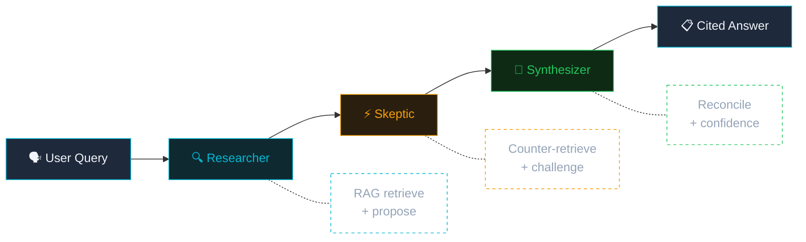

<div align="center">
  <h1>Quorum 🏛️</h1>
  <p><em>Offline multi-agent document council — 3 AI agents debate your documents to a cited answer. The visible disagreement IS the trust mechanism.</em></p>
  

  <br/>

  [](https://dorahacks.io/hackathon/qvac-unleach-edge-ai-i/detail)
  [](https://dorahacks.io/hackathon/qvac-unleach-edge-ai-i/tracks)

  <br/>

  
  
  
  
  [](https://github.com/edycutjong/quorum/actions/workflows/ci.yml)

</div>

---

## 💡 The Problem & Solution

When analyzing confidential documents — legal dossiers, financial audits, HR records — you can't upload them to cloud AI. But a single LLM will just parrot the first document it reads, missing contradictions.

**Quorum** solves this with a **3-agent council** that cross-examines your corpus entirely offline:

**Key Features:**
- 🔍 **Researcher** — Retrieves relevant documents, proposes initial answer with citations
- ⚡ **Skeptic** — Counter-retrieves to challenge claims, finds planted contradictions
- 🧩 **Synthesizer** — Reconciles viewpoints, assigns HIGH/MEDIUM/LOW confidence
- 📚 **Every claim cited** — Source chunk mapped to exact document
- 🔴 **Contradiction detection** — Skeptic catches what a single LLM would miss

## 🎥 See It In Action

*Real local inference — the network is off the entire time (note the **`● LIVE · QVAC`** pill).*

<p align="center">
  
</p>

**The contradiction catch.** Ask *"Who authorized the Entity X payment and was it legitimate?"* — a naive RAG repeats the memo (*"VP Chen, March 12"*), but Quorum's Skeptic re-queries and surfaces the conflicting HR access logs and board minutes, so the Synthesizer returns a **cited, disputed verdict with lowered confidence**:

<p align="center">
  
</p>

<table>
  <tr>
    <td width="50%" align="center"></td>
    <td width="50%" align="center"></td>
  </tr>
  <tr>
    <td align="center"><em>📚 Every claim maps to an exact source chunk</em></td>
    <td align="center"><em>⚖️ A second debate — governance §4.2 compliance</em></td>
  </tr>
</table>

## 🏗️ Architecture & Tech Stack



| Layer | Technology |
|---|---|
| **Frontend** | Vite 8, React 19, TypeScript |
| **AI Engine** | @qvac/sdk (completion, RAG) |
| **Embeddings** | GTE-Large-FP16 via @qvac/sdk |
| **LLM** | Llama 3.2 1B (local) |

## 🏆 Why ONLY QVAC?

| QVAC SDK Method | Quorum Usage | Cloud Alternative You'd Need |
|---|---|---|
| `loadModel()` + `completion()` | Runs all 3 agents (Researcher, Skeptic, Synthesizer) | OpenAI API ($0.03/query × 3 agents) |
| `ragIngest()` + `ragSearch()` | Embeds & searches private dossier locally | Pinecone + OpenAI Embeddings API |
| `loadModel(GTE_LARGE_FP16)` | 1024-dim embeddings for citation matching | Cohere Embed API |
| `unloadModel()` | Memory lifecycle — load once, 3 agents, unload | N/A (cloud doesn't care) |

**Take QVAC out and you'd need 3 separate cloud services** (OpenAI + Pinecone + Cohere), a network connection, and your confidential documents would leave your machine.

## 📋 Dossier — Planted Contradictions

The demo includes a 5-document **Northwind dossier** with deliberate contradictions:

| Document | Claims | Contradiction |
|---|---|---|
| `memo_ref_4821.txt` | VP Chen authorized $2.4M payment March 12 | Chen was on PTO |
| `board_minutes_march.txt` | Chen PTO March 11-15, no Entity X discussion | Memo claims March 12 |
| `q1_financial_report.txt` | Audit flags: no SOW, no deliverables | Payment processed |
| `hr_access_logs.txt` | No badge/VPN access March 12 | Memo timestamped March 12 |
| `governance_charter.txt` | >$1M needs board resolution | No board approval |

## 🚀 Getting Started

```bash
git clone https://github.com/edycutjong/quorum.git
cd quorum
npm install
npm run start                              # backend (:3001) + web app (:5173)
curl -X POST http://localhost:3001/api/seed   # ingest the dossier into the local RAG store
# open http://localhost:5173 — status pill should read "LIVE · QVAC"
```

> First launch downloads the local models. The status pill reads **DEMO · OFFLINE**
> until the backend is reachable; once it's up and seeded it switches to **LIVE · QVAC**.

> **Devastating Demo Query:** "Who authorized the Entity X payment and was it legitimate?"

## 📊 Benchmarks

Run `npm run bench` to reproduce. This runs the **real** 3-agent council over the
dossier via `@qvac/sdk` and writes `data/bench_results.json` (latency, contradiction
recall, citation coverage). Use `npm run bench -- --assert` to fail on budget regressions.

Representative run on an **Apple M1 Max (32 GB)** — reproduce with `npm run bench`:

| Metric | Measured | Budget |
|---|---|---|
| Full Council Round (p50 / p95) | ~2.5s / ~2.7s | <15,000ms |
| Model Load (cold) | ~1.2s | <10,000ms |
| Corpus Ingest (5 docs → 9 chunks) | ~1.8s | — |
| Citation coverage | 1.0 | ≥0.95 |
| Contradiction recall (planted set) | 0.67–1.0¹ | 1.0 |
| Peak RAM | ~196 MB | <4,096MB |

> ¹ Recall varies run-to-run: the Skeptic reliably retrieves the conflicting
> documents, but Llama-3.2-1B is non-deterministic and doesn't always phrase an
> explicit objection — an honest limitation of a 1B model on-device. `npm run bench`
> records real measurements from your hardware into `data/bench_results.json`.
> (The legacy `scripts/bench.py` is a deterministic simulation kept only as a CI smoke test.)

## 🧪 Testing & CI

**136 tests:** 128 unit tests (Vitest) covering RAG citation mapping, agent orchestration, contradiction-driven confidence, and the offline SDK wrappers, plus 8 E2E specs (Playwright) — backed by 18 offline-verification checks (`verify_offline.py`).

**7-stage pipeline:** Quality → Security → Build → E2E → Performance → Offline → Deploy

```bash
# ── Code Quality ────────────────────────────
npm run lint           # ESLint
npm run typecheck      # TypeScript check
npm run ci             # Full quality gate

# ── E2E & Performance ──────────────────────
npm run e2e            # Playwright E2E (3 suites)
npm run lighthouse     # Lighthouse CI audit

# ── Evidence Bundle ─────────────────────────
python3 scripts/verify_offline.py     # airgapped run — disconnect network first
npm run bench                         # real council latency + contradiction recall
python3 scripts/check_submission_readiness.py
```

| Layer | Tool | Status |
|---|---|---|
| Code Quality | ESLint + TypeScript | ✅ |
| E2E Testing | Playwright (3 suites) | ✅ |
| Security (SAST) | CodeQL | ✅ |
| Security (SCA) | Dependabot + npm audit | ✅ |
| Secret Scanning | TruffleHog | ✅ |
| Performance | Lighthouse CI | ✅ |
| Offline Verification | verify_offline.py (7/7) | ✅ |

## 📁 Project Structure
```
quorum/
├── docs/                   # README assets
├── data/fixtures/
│   └── northwind_dossier/  # 5 docs with planted contradictions
├── e2e/                    # Playwright E2E tests
├── scripts/                # seed, bench, verify, readiness
├── src/
│   ├── core/
│   │   ├── qvac.ts         # @qvac/sdk wrapper
│   │   ├── rag.ts          # Corpus RAG pipeline
│   │   └── council.ts      # 3-agent council orchestration
│   ├── App.tsx             # Debate transcript viewer
│   └── App.css             # Dark mode theme
├── .github/                # CI/CD + CodeQL + Dependabot
├── playwright.config.ts
├── lighthouserc.json
└── README.md
```

## ⚠️ Honest Limitations

1. Small model — limited reasoning depth vs cloud LLMs
2. Sequential agents — no true parallel debate
3. English only
4. Fixed dossier — no live document upload yet
5. Mock inference in demo mode

## 📄 License
[MIT](LICENSE) © 2026 Edy Cu

## 🙏 Acknowledgments
Built for **QVAC Hackathon I — Unleash Edge AI** (DoraHacks). Thank you to the QVAC team for making multi-agent AI possible on the edge.
